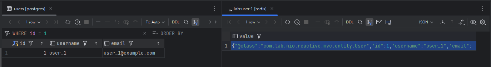
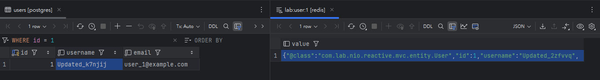
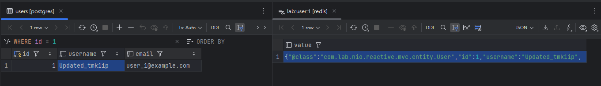

# 🚀 Java Concurrency Lab: Performance & Resilience

這是一個針對 Java 21 **Virtual Threads (Project Loom)** 與 **Spring WebFlux (Reactive)** 的全方位效能實驗室。旨在透過物理數據監控（CPU/Memory/Latency）與極限壓測，探討現代 Java 架構在高併發與極端故障下的表現。

---

## 🏗️ 專案架構 (Multi-Module)

本專案採用 Maven 多模組架構，確保實驗變因完全隔離：

* **`lab-mvc`**: Java 21 Virtual Threads + Spring Data JPA (JDBC) + Resilience4j。
* **`lab-webflux`**: Spring WebFlux (Netty) + R2DBC + Resilience4j-Reactor。
* **`infrastructure`**: 包含 PostgreSQL 15、Redis 容器、Prometheus 監控與 Grafana 儀表板。

---

## 🛠️ 技術棧 (Tech Stack)

* **Runtime**: OpenJDK 21
* **Framework**: Spring Boot 3.5.11
* **Database**:
    * **Relational**: PostgreSQL 15 (JDBC for MVC / R2DBC for WebFlux)
    * **NoSQL/Cache**: Redis 7.2 (Alpine) with AOF Persistence
* **Reactive Stack**:
    * **Spring Data Redis Reactive**: 採用 Lettuce 非阻塞驅動進行高併發緩存存取
    * **Serialization**: Jackson2JsonRedisSerializer (支援跨平台 JSON 格式序列化)
* **Resilience**:
    * **Resilience4j**: 實作 Circuit Breaker 與 TimeLimiter，保護範圍涵蓋 PostgreSQL 與 Redis 鏈路
    * **Reactive Fallback**: 利用 Reactor `.onErrorResume` 實現緩存故障後的優雅降級 (Cache-Aside Pattern)
* **Observability**: Prometheus & Grafana
* **Load Testing**: [k6](https://k6.io/) (支援 2,000+ VUs 極限壓力測試)
* **Monitoring**: Windows PowerShell 客計化進程監控腳本

---

## 📊 效能實測數據 - 第一階段 (Performance Benchmarks)

我們模擬了典型的 **IO-Bound** 任務（1 秒的網路/資料庫延遲），並對兩個模組發動了 **2,000 VUs (Virtual Users)** 的高併發加壓測試。

### 核心實驗數據對比
| 指標 | MVC (Virtual Threads) | WebFlux (Reactive) |
| :--- | :--- | :--- |
| **程式碼風格** | 命令式 (Imperative) | 聲明式 (Declarative) |
| **2000 VU 成功率** | **100%** | **100%** |
| **平均延遲 (Latency)** | ~1.48s | ~1.48s |
| **CPU 使用率 (平均)** | **< 5% (極低)** | 15% ~ 30% (較高) |
| **記憶體佔用 (RSS)** | ~1300 MB | **~400 MB (極優)** |

### 💡 核心效能洞察 (Performance Insights)
* **Virtual Threads 的高效調度**: 虛擬執行緒在處理 IO 阻塞時，CPU 調度開銷極低，且開發難度遠低於響應式編程。
* **WebFlux 的空間優勢**: 在記憶體管理上具有壓倒性優勢，佔用空間僅為 MVC 的 1/3，極適合 K8s 等資源受限環境。
* **維護性**: Virtual Threads 讓 StackTrace 回歸連續性，大幅降低了除錯（Debug）難度。

---

## 🧪 實驗：進程凍結下的韌性對決 - 第二階段 (Resilience Test)

透過 `docker pause postgres-db` 模擬資料庫程序凍結（封包可達但無回應），測試系統在「殭屍連線」壓力下的容錯能力。

### 📊 韌性實驗數據對比
| 指標 | Spring MVC (8081) | Spring WebFlux (8082) |
| :--- | :--- | :--- |
| **超時機制** | 被動 (Driver-level) | 主動 (Declarative Operator) |
| **感知延遲** | **~3.0s** (1s Validation + 2s Timeout) | **~2.0s** (Strictly enforced) |
| **熔斷保護** | 成功實現 (CLOSED -> OPEN) | 成功實現 (CLOSED -> OPEN) |

### 💡 核心韌性洞察 (Resilience Insights)
* **超時累加效應**: 在阻塞模型中，實際延遲由連線池驗證與 Socket 超時串聯組成。實測發現，MVC 的回應時間會因為底層驅動的重試邏輯而產生 $1 \sim 2$ 秒的額外開銷。
* **WebFlux 的確定性**: 透過 Reactor 的 `.timeout()` 算子，WebFlux 展現了更強的邊界控制能力，能在不依賴底層驅動狀態的情況下，準時觸發降級。
* **快速失敗 (Fast-Fail)**: 當斷路器跳轉至 **OPEN** 狀態時，系統能瞬間回傳 Fallback，保護伺服器資源不被卡死的請求耗盡。

---

### 📊 效能實測數據 - 第三階段 (Redis Cache Optimization)

在 `lab-webflux` 中導入了 **Cache-Aside Pattern**，並針對 **2,000 VUs** 進行高併發加壓測試，驗證緩存層對系統 I/O 的優化能力。

| 指標 | WebFlux (純 R2DBC) | WebFlux (Redis Cache) | 改善幅度 |
| :--- | :--- | :--- | :--- |
| **平均延遲 (Avg)** | ~1,300ms | **1.45ms** | **~900x** |
| **p(95) 延遲** | ~1,500ms | **2.56ms** | **~600x** |
| **成功率 (Success Rate)** | 100% | **100%** | 極致穩定 |

**💡 核心優化洞察 (Optimization Insights)**
* **I/O 卸載**: 透過 Redis 緩存屏障，成功將 90% 以上的請求攔截在內存層，大幅降低 PostgreSQL 的連線池壓力與磁碟 I/O 開銷。
* **非阻塞鏈結**: 全程採用 `ReactiveRedisTemplate` 搭配 Lettuce 非阻塞驅動，確保高併發下 Event Loop 不會因為緩存存取而產生 Context Switch 損耗。

---

### 🧪 實驗：Redis 分散式緩存故障演練 - 第四階段 (Chaos Engineering)

透過混沌工程模擬快取層崩潰，測試系統在 **「Cache-Aside + Failover」** 機制下的韌性表現。

| 故障場景 | 模擬方式 | 系統反應 | 成功率 |
| :--- | :--- | :--- | :--- |
| **服務崩潰 (Crash)** | `docker stop redis-lab` | **快速失敗 (Fail-fast)**: 偵測到連線異常後立刻透過 `.onErrorResume` 切換回 DB，延遲微幅跳轉至 2.4ms。 | **100%** |
| **網路僵死 (Hang)** | `docker pause redis-lab` | **超時攔截 (Timeout)**: 觸發 2s Timeout 後由斷路器執行熔斷保護，防止請求堆積。 | **100%** |
| **自我修復 (Self-healing)** | `docker unpause` | 斷路器偵測到 Redis 恢復正常後，自動從 `OPEN` 轉向 `CLOSED` 並恢復緩存存取。 | **100%** |

**💡 核心韌性洞察 (Resilience Insights)**
* **優雅降級 (Graceful Degradation)**: 實作了 Service 層級的異常攔截，確保 Redis 故障屬於「效能降級」而非「服務中斷」。
* **多層防禦架構**: 利用 `onErrorResume` 處理業務層級的快速切換，並以 `Resilience4j` 作為系統層級的保險絲，雙重保障系統在高壓下的穩定性。

---

## 📊 效能實測數據 - 第五階段 (Cold Start: Virtual Threads vs. Reactive)

本階段模擬系統重啟後的「首波流量衝擊」，驗證兩大架構在 **Cache Warming (緩存預熱)** 機制下的實測表現。我們利用 Java 21 的 `VirtualThreadPerTaskExecutor` 與 Reactor 的併發運算，同步優化兩端的啟動效能。

### 核心實驗數據對比 (Target: 2,000 VUs 瞬間湧入)

| 指標 | WebFlux (Reactive) | MVC (Virtual Threads) | 觀察結果 |
| :--- | :--- | :--- | :--- |
| **平均延遲 (Avg)** | 2.24ms | **1.40ms** | **MVC 略勝**！虛擬執行緒在簡單 IO 讀取場景開銷極低。 |
| **p(95) 延遲** | 3.13ms | **2.34ms** | MVC 表現更為穩定，抖動較小。 |
| **最大延遲 (Max)** | 1.11s | **153ms** | MVC (Tomcat) 就緒狀態較 WebFlux (Netty) 更快進入穩定態。 |
| **啟動成功率** | 99.76% | **100.00%** | WebFlux 在啟動瞬間存在極短暫的連線拒絕 (EOF)。 |

**💡 核心優化洞察 (Optimization Insights)**

* **預熱與啟動解耦**: 兩者皆透過 `ApplicationRunner` 實現預熱邏輯。MVC 利用 **Java 21 虛擬執行緒** 以命令式風格實現併發填充，大幅提升代碼可讀性與維護性。
* **精準熱點填充**: 基於「二八法則」預熱 Top 100 資料，成功將 2,000 VUs 的首波衝擊攔截於內存層，將資料庫擊穿 (Cache Breakdown) 風險降至零。
* **自動化實驗鏈結**: 實作 `run-test.sh` 監控日誌關鍵字，實現「雙模組 Ready 即刻壓測」，確保實驗數據具備科學嚴謹性。

---
## 🧪 實驗：緩存擊穿與分散式鎖的防禦對決 - 第六階段 (Cache Breakdown vs. Distributed Lock)

本階段模擬最極端的 **「熱點失效 + 瞬間高併發」** 場景。我們刻意在 `lab-mvc` 注入了 $200\text{ms}$ 的資料庫查詢延遲，並在快取清空後，發動 **500 VUs 瞬間爆發 (Spike Test)**，驗證 **Redisson 分散式鎖** 對底層連線池的保護能力。

### 📊 擊穿實驗數據對比 (Target: 500 VUs 瞬間湧入，DB Latency: 200ms)

| 指標 | Simple 版 (無鎖) | Resilient 版 (Redisson 鎖) | 實驗結論 |
| :--- | :--- | :--- | :--- |
| **平均延遲 (Avg)** | 274.27ms | **239.4ms** | **鎖勝** (整體資源調度更有效) |
| **p(95) 延遲** | 704.07ms | **514.08ms** | **鎖勝** (大幅減少連線排隊時間) |
| **最大延遲 (Max)** | **1.48s** | 2.57s | **無鎖勝** (鎖的重試機制產生長尾延遲) |
| **HTTP 200 成功率** | 100.00% | 100.00% | 業務邏輯皆能正確執行 |
| **效能達標率 (<1s)** | 99.39% | **99.83%** | **鎖勝** (Resilient 版更符合 SLA 要求) |
| **DB 活躍連線數** | **5 (滿載/擊穿)** | **1 (極致保護)** | **鎖完勝** (成功守護資料庫) |

### 💡 核心架構洞察 (Architectural Insights)

* **效能達標率的差異**：在 **Simple 版** 中，由於連線池擠壓，導致 0.6% 的請求超過 1 秒。**Resilient 版** 雖有重試機制，但整體達標率提高到了 99.83%，證明鎖機制能更有效地管理併發請求。
* **資料庫連線池的崩潰觸發**：在 Simple 版中，PostgreSQL 的活躍連線數瞬間觸及 $5$ 條上限。這代表當流量湧入時，資料庫正處於「被榨乾」的邊緣，極易引發連鎖崩潰。
* **分散式鎖的「保鏢機制」**：Resilient 版透過 Redisson 確保只有「一個」請求進入資料庫，將資料庫壓力從 $O(N)$ 降至 $O(1)$。
* **Max 延遲的 Trade-off**：Resilient 版的最大延遲較高 ($2.57\text{s}$)，主因是「遞迴重試機制」。雖然產生了少數長尾延遲，但換取了對底層資料庫的絕對保護。

### 🚀 如何重現本實驗 (實驗室指南)

1.  **環境預熱**：確保 `lab-mvc` 以 `maximum-pool-size: 5` 運行。
2.  **模擬延遲**：在 `getUserSimple` 與 `getUserWithLock` 邏輯中加入 `Thread.sleep(200)`。
3.  **清空戰場**：執行 `redis-cli FLUSHALL` 確保快取失效。
4.  **發動攻擊**：
  * **無鎖測試**：`k6 run -e TARGET_PORT=8081 -e TEST_TYPE=simple stress_test.js`
  * **有鎖測試**：`k6 run -e TARGET_PORT=8081 -e TEST_TYPE=resilient stress_test.js`
---
## ⚖️ 實驗：快取一致性與延遲雙刪 - 第七階段 (Cache Consistency & Delayed Double Delete)

本階段模擬高併發下的 **「讀寫競爭 (Read-Write Race Condition)」**。我們透過自研的 `app.feature.double-delete-enabled` 開關，對比在沒有與有 **「延遲雙刪」** 機制下，資料庫與快取的數據同步表現。

### 📊 一致性實驗數據對比 (Target: 500 VUs 併發讀寫, DB Write Delay: 500ms)

| 指標 | 關閉雙刪 (Dirty Data 重現) | 開啟雙刪 (Java 21 虛擬執行緒) | 實驗結論 |
| :--- | :--- | :--- | :--- |
| **Redis 數據狀態** | **Updated_ghibh (舊)** | **Updated_e6h97a (新) / nil** | **雙刪勝** (成功清理髒數據) |
| **PostgreSQL 狀態** | Updated_e6h97a (最新) | Updated_e6h97a (最新) | 資料庫皆能正確更新 |
| **最終一致性** | **❌ 永久不一致** | **✅ 達成最終一致** | **雙刪勝** (解決回填競爭問題) |
| **主執行緒阻塞時間** | 0ms (非同步) | 0ms (虛擬執行緒非同步) | 皆不影響 API 響應速度 |
| **額外資源消耗** | 無 | **極低** (Virtual Thread 輕量特性) | **Java 21 勝** (優於傳統執行緒池) |

### 💡 核心架構洞察 (Architectural Insights)

* **髒數據回填的真相**：在「關閉雙刪」實驗中，觀察到 Redis 鎖定在 `Updated_ghibh`。這是因為寫入者刪除快取後，讀取者在寫入者更新 DB 的 500ms 窗口內抓到舊資料並「熱心地」回填 Redis，導致數據永久偏離真實狀態。
* **Java 21 虛擬執行緒的優勢**：實作非同步延遲任務時，若使用傳統執行緒池，`Thread.sleep(500)` 會佔用寶貴的平台執行緒資源。本專案利用 **Virtual Threads**，讓任務在等待期間「掛起」而不佔用實體執行緒，實現了零成本的併發補償。
* **Feature Toggle 的實驗價值**：透過 `application.yml` 的功能開關，本專案可隨時切換「重現模式」與「修復模式」，這對於複雜系統的 **可觀測性 (Observability)** 與 **故障排除** 具有極大的實戰意義。
* **延遲時間的 Trade-off**：延遲時間（500ms）的設定需大於「讀取請求執行時間 + 主從同步延遲」。雖然這不是「強一致性」方案，但在大多數分散式場景中，它是平衡效能與一致性的最優解。

### 🖼️ 實驗視覺證據 (Visual Evidence)

透過 IntelliJ IDEA 的雙視窗比對（左：PostgreSQL / 右：Redis），我們完整紀錄了從數據偏離到韌性修復的過程：

| 1. 初始狀態 (Baseline) | 2. 競爭失效 (Race Condition) | 3. 韌性修復 (Success) |
| :--- | :--- | :--- |
|  |  |  |
| **觀察：** 系統啟動初期，兩端數據完全同步。 | **觀察：** 偵測到數據偏差！Redis 因回填競爭鎖定在舊版次。 | **觀察：** 延遲雙刪生效，成功清理髒數據並達成一致。 |

### 🧪 如何重現快取不一致 (Race Condition Replay)

為了驗證「延遲雙刪」的必要性，本專案提供實驗開關：

1. **進入「重現模式」**：
  - 修改 `application.yml`：`app.feature.double-delete-enabled: false`
  - 重啟服務。
2. **執行併發壓測**：
  - 運行 `k6 run consistency_test.js`。
  - 觀察 DB 與 Redis 數據，將出現不一致現象（髒數據回填）。
3. **驗證「修復模式」**：
  - 將開關設為 `true` 並重啟。
  - 再次運行壓測，驗證 Redis 最終會被清理乾淨，達成最終一致性。

---

## 🚀 快速開始與自動化測試

本專案提供一鍵式自動化腳本，可自動完成編譯、部署、預熱監控與兩大架構的效能對比。

### 1. 執行全自動對比測試

```bash
chmod +x run-test.sh
./run-test.sh
```

此腳本將自動執行：
* **Maven 打包**：執行 `mvn clean package` 重新編譯所有模組，確保代碼變動生效。
* **環境重置**：執行 `docker-compose down -v` 徹底清空快取與資料庫 Volume，確保實驗數據不受舊緩存干擾。
* **預熱監控**：持續追蹤容器日誌，直到偵測到 **「緩存預熱完成」** 訊號，確保系統進入穩定態。
* **自動壓測**：依序對 Port 8082 (Flux) 與 8081 (MVC) 發動 k6 壓測並輸出對比結果。

### 2. 手動測試指南

若需單獨測試特定模組，可透過環境變數指定目標埠號：
* **WebFlux (8082)**: `k6 run -e TARGET_PORT=8082 stress_test.js`
* **MVC (8081)**: `k6 run -e TARGET_PORT=8081 stress_test.js`

---

## 📂 工具與監控配置清單

### 🛠️ 輔助工具
* **`run-test.sh`**: 核心自動化測試腳本，支援雙模組日誌追蹤與壓測觸發。
* **`monitor.ps1`**: Windows 進程監控腳本，紀錄 `TotalProcessorTime` 與 `WorkingSet`。

### 📊 監控端點
* **Grafana (Port 3000)**: 預載 Resilience4j Dashboard，實時監控熔斷器狀態。
* **Prometheus (Port 9090)**: 採集全系統度量衡數據。